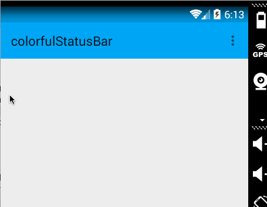
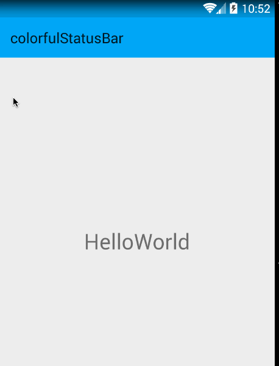
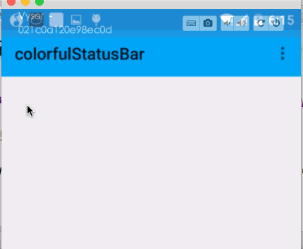
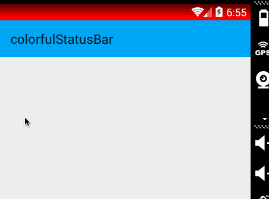
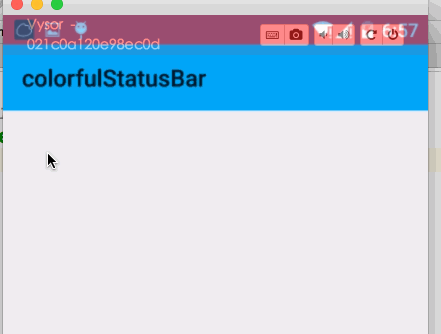

# ColorfulStatusBar
Android app状态栏变色。

适用于版本大于等于19以上。

## 用法

Activiy onCreate中调用`setContentView()`后添加：

```java
StatusBarCompat.compat(this);
```

如果需要制定状态栏颜色,使用此方法：

```java
StatusBarCompat.compat(this, 0xFFFF0000);
```

## 效果图

###默认效果

* 4.4



* 如果是banner



* 5.x




###指定颜色


* 4.4



* 5.x

